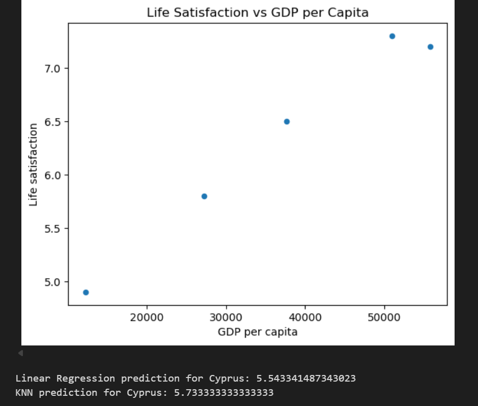
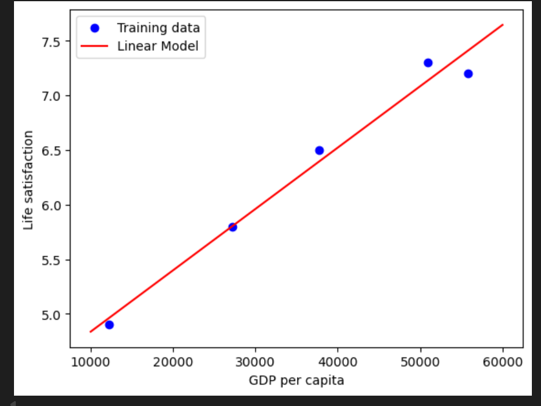

# CHAPTER 1 - THE MACHINE LEARNING

## Apa Itu Machine Learning?
Machine Learning (ML) adalah bidang studi yang memberikan kemampuan kepada komputer untuk belajar tanpa diprogram secara eksplisit. Menurut Arthur Samuel (1959): "Bidang studi yang memberikan kemampuan komputer untuk belajar tanpa diprogram secara eksplisit." Menurut Tom Mitchell (1997): "Sebuah program dikatakan belajar dari pengalaman E terkait tugas T dan ukuran performa P, jika performanya pada T meningkat seiring pengalaman E."

Bab ini menjelaskan apa itu ML: ilmu memprogram komputer untuk belajar dari data. Definisi meliputi:
- Arthur Samuel (1959): Bidang studi yang memberikan kemampuan kepada komputer untuk belajar tanpa harus diprogram secara eksplisit.
- Tom Mitchell (1997): Sebuah program belajar dari pengalaman E terkait tugas T dan ukuran kinerja P jika kinerjanya pada T meningkat seiring dengan E.

Contoh: Filter spam belajar dari email yang diberi label spam/ham (non-spam) untuk memprediksi email baru.

## Mengapa Menggunakan Machine Learning
Pemrograman tradisional untuk filter spam melibatkan analisis pola (misalnya, kata-kata seperti “4U,” “kartu kredit,” “gratis,” “luar biasa” dalam baris subjek, nama pengirim, dan isi email) serta penulisan algoritma deteksi untuk masing-masing pola, pengujian, dan iterasi hingga hasilnya memadai. Hal ini menghasilkan daftar aturan yang panjang dan kompleks yang sulit untuk dipelihara.Hal ini menghasilkan daftar aturan yang panjang dan kompleks yang sulit untuk dipelihara.


Sebaliknya, filter spam berbasis Machine Learning secara otomatis mempelajari prediktor yang baik dengan mendeteksi pola kata yang tidak biasa sering muncul dalam contoh spam dibandingkan dengan email normal.


ML unggul dalam masalah kompleks tanpa algoritma yang diketahui, seperti pengenalan suara (menetapkan aturan secara kaku untuk membedakan “satu” dan “dua” tidak dapat diterapkan secara luas pada aksen, kebisingan, bahasa, dan jutaan penutur—ML belajar dari rekaman contoh).

Jadi kesimpulannya, ML sangat cocok untuk:
- Masalah yang memerlukan banyak penyesuaian halus atau daftar aturan yang panjang (satu algoritma ML seringkali menyederhanakan kode dan berkinerja lebih baik).
- Masalah kompleks di mana pendekatan tradisional tidak menghasilkan solusi yang baik (teknik ML dapat menemukan solusi).
- Lingkungan yang fluktuatif (sistem ML dapat beradaptasi dengan data baru).
- Mendapatkan wawasan tentang masalah kompleks dan jumlah data yang besar (menemukan pola tersembunyi).

## Contoh Aplikasi Machine Learning
- Contoh aplikasi Machine Learning di kehidupan sehari-hari antara lain:
- Klasifikasi gambar produk (menggunakan CNN).
- Deteksi tumor di scan otak (semantic segmentation dengan CNN).
- Klasifikasi artikel berita (NLP dengan RNN/CNN/Transformers).
- Moderasi komentar ofensif (text classification).
- Ringkasan dokumen (NLP summarization).
- Prediksi revenue (regression dengan Linear Regression, Random Forest, dll.).
- Pengenalan suara (RNN/CNN/Transformers).
- Deteksi fraud kartu kredit (anomaly detection).
- Segmentasi pelanggan (clustering).
- Visualisasi data kompleks (dimensionality reduction).
- Sistem rekomendasi (neural networks).
- Bot game cerdas (Reinforcement Learning, e.g., AlphaGo).

## Jenis Sistem Machine Learning
Jenis jenis sitem pada machine learning diklasifikasikan berdasarkan:

### Supervised/Unsupervised Learning
- **Supervised Learning**: Data pelatihan yang diberikan ke algoritma mencakup solusi yang diinginkan, yang disebut label. Tugas umum:
  - Klasifikasi: Mengelompokkan instance (misalnya, filter spam mengklasifikasikan email sebagai spam atau ham).
  - Regresi: Memprediksi nilai numerik (misalnya, memprediksi harga mobil berdasarkan prediktor seperti jarak tempuh, usia, merek). Catatan: Atribut adalah jenis data (misalnya, “jarak tempuh”), sementara fitur memiliki beberapa arti tetapi umumnya berarti atribut ditambah nilainya. Algoritma: k-Nearest Neighbors, Regresi Linier, Regresi Logistik (menghasilkan probabilitas kelas, misalnya 20% kemungkinan spam), Mesin Vektor Dukungan (SVM), Pohon Keputusan dan Hutan Acak, Jaringan Saraf Tiruan.
  - Beberapa algoritma jaringan saraf (misalnya, autoencoders dan restricted Boltzmann machines) dapat bersifat tidak diawasi, sementara yang lain (misalnya, deep belief networks) bersifat semi-diawasi.

  - **Unsupervised Learning**: Data untuk training tidak dilabeli. Sistem belajar tanpa panduan. Tugas utama:

- Pengelompokan: Mengelompokkan instance serupa secara otomatis (misalnya, mengelompokkan pengunjung blog berdasarkan demografi atau perilaku). Algoritma: K-Means, DBSCAN, Analisis Pengelompokan Hierarkis (HCA).
- Deteksi anomali dan deteksi keunikan: Mendeteksi instance yang tidak biasa, misalnya, deteksi penipuan, cacat produksi. Algoritma: One-class SVM, Isolation Forest.
- Visualisasi dan pengurangan dimensi: Menyederhanakan data tanpa kehilangan terlalu banyak informasi untuk visualisasi atau ekstraksi fitur. Algoritma: Analisis Komponen Utama (PCA), Kernel PCA, Embedding Linier Lokal (LLE), Embedding Tetangga Stochastik t-Distribusi (t-SNE). Ekstraksi fitur menggabungkan fitur yang berkorelasi (misalnya, jarak tempuh dan usia mobil menjadi “keausan”).
- Pembelajaran aturan asosiasi: Menemukan hubungan menarik antara atribut (misalnya, orang yang membeli saus barbekyu dan keripik kentang juga cenderung membeli steak). Algoritma: Apriori, Eclat.

- **Semisupervised Learning**: Mengatasi data pelatihan yang sebagian diberi label, biasanya terdiri dari banyak data yang tidak diberi label dan sedikit data yang diberi label. Algoritma terlebih dahulu mengelompokkan instance yang serupa (tanpa pengawasan), kemudian menggunakan label untuk menyebarkan ke dalam kelompok (misalnya, Google Photos mengenali orang yang sama dalam foto dengan hanya beberapa label). 
Contoh: Jaringan keyakinan dalam (DBN) berdasarkan mesin Boltzmann terbatas bertumpuk (RBM), dilatih tanpa pengawasan kemudian disesuaikan dengan pengawasan.

- **Reinforcement Learning**: Sistem pembelajaran mengamati lingkungan, memilih, dan melakukan tindakan, serta menerima hadiah atau hukuman . Ia belajar sendiri strategi terbaik (kebijakan) untuk mendapatkan hadiah maksimal seiring waktu (misalnya, robot belajar berjalan; AlphaGo belajar dengan menganalisis jutaan permainan dan bermain ribuan kali melawan dirinya sendiri; selama pertandingan melawan juara, proses pembelajaran dimatikan).

### Batch and Online Learning
- **Batch Learning (Offline Learning)**: Dilatih menggunakan semua data yang tersedia secara offline (membutuhkan waktu dan sumber daya). Kemudian diluncurkan tanpa pembelajaran lebih lanjut (menggunakan apa yang telah dipelajarinya). Untuk menangani data baru atau perubahan, latih versi baru dari awal menggunakan dataset lengkap (termasuk data lama dan baru), lalu ganti versi lama (dapat diotomatisasi). Cocok jika data tidak berubah dengan cepat dan sumber daya memungkinkan.

- **Online Learning (Incremental Learning)**: Dilatih secara bertahap dengan memberikan contoh data secara berurutan, baik secara individual maupun dalam batch kecil . Cepat dan murah, dapat belajar secara real-time dari dataset besar atau data streaming (misalnya, memprediksi harga saham). Pembelajaran out-of-core: Mengelola dataset yang terlalu besar untuk memori utama dengan memuat bagian-bagiannya . Parameter hiper pembelajaran: Seberapa cepat beradaptasi (tinggi: belajar cepat tetapi melupakan data lama dengan cepat; rendah: lebih stabil tetapi kurang sensitif terhadap noise/outlier atau data buruk). Tantangan: Jika data buruk dimasukkan, kinerja menurun—monitor dan matikan pembelajaran atau roll back jika terdeteksi.

### Instance-Based Versus Model-Based Learning
- **Instance-Based Learning**: Sistem mempelajari contoh-contoh tersebut secara mendalam, kemudian menggeneralisasikan ke kasus-kasus baru menggunakan ukuran kemiripan, misalnya, menandai email sebagai spam jika sangat mirip dengan email spam yang sudah diketahui berdasarkan jumlah kata; bentuk paling sederhana adalah k-Nearest Neighbors, yang mengklasifikasikan berdasarkan suara mayoritas dari contoh-contoh yang paling mirip.

- **Model-Based Learning**: Membangun model dari contoh-contoh, lalu menggunakan model tersebut untuk membuat prediksi. Contoh: Meneliti apakah uang membuat orang bahagia menggunakan data kepuasan hidup dan PDB per kapita—modelkan kepuasan hidup sebagai fungsi linier (Persamaan 1-1: life_satisfaction = θ₀ + θ₁ × GDP_per_capita). Pelatihan menemukan parameter θ₀ (bias) dan θ₁ (berat) untuk menyesuaikan data dengan sebaik-baiknya . Fungsi utilitas mengukur kebaikan, fungsi biaya mengukur keburukan.

Kode python Model-Based Learning (Linear Regression vs KNN)
 ```python:disable-run
 import matplotlib.pyplot as plt
import numpy as np
import pandas as pd
from sklearn.linear_model import LinearRegression
from sklearn.neighbors import KNeighborsRegressor

# --- Data simulasi GDP per capita dan Life satisfaction ---
data = {
    "Country": ["Hungary", "Korea", "France", "Australia", "United States"],
    "GDP per capita": [12240, 27195, 37675, 50962, 55805],
    "Life satisfaction": [4.9, 5.8, 6.5, 7.3, 7.2]
}
country_stats = pd.DataFrame(data)

# --- Visualisasi data ---
country_stats.plot(kind='scatter', x="GDP per capita", y="Life satisfaction")
plt.title("Life Satisfaction vs GDP per Capita")
plt.show()

# --- Linear Regression ---
X = np.c_[country_stats["GDP per capita"]]
y = np.c_[country_stats["Life satisfaction"]]

lin_model = LinearRegression()
lin_model.fit(X, y)

# Prediksi untuk Cyprus
X_new = [[22587]]
print("Linear Regression prediction for Cyprus:",
      lin_model.predict(X_new)[0][0])

# --- KNN Regression ---
knn_model = KNeighborsRegressor(n_neighbors=3)
knn_model.fit(X, y)
print("KNN prediction for Cyprus:",
      knn_model.predict(X_new)[0][0])

# --- Plot hasil regresi ---
X_fit = np.linspace(10000, 60000, 100).reshape(-1, 1)
plt.scatter(X, y, color='blue', label='Training data')
plt.plot(X_fit, lin_model.predict(X_fit), color='red', label='Linear Model')
plt.xlabel("GDP per capita")
plt.ylabel("Life satisfaction")
plt.legend()
plt.show()
  ```

  
  
  Code ini melatih dua model, yaitu Linear Regression dan KNN. Code ini membandingkan prediksi life satisfaction untuk negara yang tidak ada di data (cyprus) dan menunjukkan visualisasi hubungan antara GDP dan kebahagiaan.

  ## Typical Machine Learning Project Workflow
  Studi data, jelajahi dan visualisasikan data (misalnya, scatterplot), siapkan data untuk algoritma ML, pilih dan latih model, sesuaikan model melalui analisis kesalahan dan pencarian hiperparameter, evaluasi pada set uji, luncurkan, pantau, dan rawat. Bab 2 membahas proyek end-to-end.

  ## Main Challenges of Machine Learning
  Biasanya disebabkan oleh data yang buruk (kuantitas, kualitas) daripada algoritma yang buruk.

  ### Insufficient Quantity of Training Data
  Machine Learning membutuhkan banyak data (ribuan untuk masalah sederhana, jutaan untuk masalah kompleks seperti gambar atau suara). Artikel tahun 2001 “The Unreasonable Effectiveness of Data” mencatat bahwa algoritma berperforma serupa jika diberikan data yang cukup (Gambar 1-20: Bahkan algoritma yang biasa-biasa saja dapat berperforma baik dengan data yang banyak). Untuk masalah kompleks, data lebih penting daripada algoritma.

  ### Nonrepresentative Training Data
  Untuk generalisasi yang baik, data pelatihan harus mewakili kasus-kasus baru. Bising sampling (kesalahan dalam sampel kecil) atau bias sampling (metode yang cacat, misalnya jajak pendapat Literary Digest 1936 yang memprediksi kemenangan Landon karena bias telepon/kelas atas; bias nonrespons). Contoh: Model linier tentang kepuasan hidup versus PDB tidak memperhitungkan negara-negara miskin—menambahkan mereka mengubah model.

  ### Poor-Quality Data
  Jika data penuh dengan kesalahan, nilai outlier, dan noise (pengukuran yang buruk), pola-pola sulit dideteksi. Luangkan waktu untuk membersihkan data: Buang/perbaiki nilai outlier, tentukan penanganan nilai yang hilang (abaikan atribut, abaikan instance, isi dengan median/nol, atau latih satu model dengan atribut tersebut dan satu tanpa atribut tersebut).

  ### Irrelevant Features
  Sampah masuk, sampah keluar. Rekayasa fitur: Pemilihan fitur (pilih yang berguna), ekstraksi fitur (gabungkan menjadi fitur baru, misalnya melalui pengurangan dimensi), buat fitur baru dengan mengumpulkan data baru.

  ### Overfitting the Training Data
  Model terlalu kompleks, belajar dari noise (generalisasi buruk). Seperti pemodelan polinomial berderajat tinggi yang cocok sempurna dengan data pelatihan tetapi tidak berguna untuk data baru. Solusi: Sederhanakan (kurangi parameter/fitur/derajat, regularisasi untuk membatasi kompleksitas), kumpulkan lebih banyak data pelatihan, kurangi noise (perbaiki kesalahan, hapus outlier).

  ### Underfitting the Training Data
  Kebalikan dari overfitting—model terlalu sederhana untuk mempelajari struktur. Solusi: Pilih model yang lebih kuat (lebih banyak parameter), berikan fitur yang lebih baik, kurangi batasan (misalnya, kurangi parameter regularisasi).

## Testing and Validating
Evaluasi model biasanya dilakukan dengan test set, namun menjadi bermasalah jika digunakan berulang kali untuk memilih model atau menyesuaikan hyperparameter, karena hal itu menyebabkan model terlalu menyesuaikan diri dengan data uji dan gagal melakukan generalisasi. Solusinya adalah holdout validation, yaitu membagi data pelatihan menjadi training set dan validation set. Beberapa model dilatih dengan nilai hyperparameter berbeda menggunakan training set, lalu dievaluasi di validation set untuk memilih yang terbaik. Model terpilih kemudian dilatih ulang menggunakan seluruh data pelatihan dan diuji pada test set untuk menilai kinerjanya secara nyata. Jika validation set terlalu kecil, hasil evaluasi tidak akurat; jika terlalu besar, data pelatihan menjadi kurang. Untuk mengatasi hal ini digunakan cross-validation, di mana pelatihan dan evaluasi dilakukan berulang kali pada beberapa subset kecil validation set, lalu hasilnya dirata-ratakan untuk mendapatkan penilaian performa yang lebih stabil, meskipun waktu pelatihan menjadi lebih lama.

## Data Mismatch
Kadang data pelatihan tersedia dalam jumlah besar, tetapi tidak mewakili kondisi data sebenarnya di produksi. Misalnya, gambar bunga dari internet berbeda dengan foto yang diambil langsung melalui aplikasi mobile. Karena itu, validation set dan test set harus terdiri dari data yang benar-benar representatif terhadap kondisi nyata. Jika model dilatih dengan data web tetapi hasilnya buruk di validation set, sulit menentukan apakah penyebabnya overfitting atau perbedaan data (data mismatch). Untuk membedakannya, digunakan train-dev set, yaitu sebagian kecil data pelatihan yang digunakan hanya untuk evaluasi. Jika model baik di train-dev set namun buruk di validation set, berarti masalahnya adalah data mismatch; jika buruk di keduanya, berarti terjadi overfitting. Solusinya adalah menyesuaikan data agar lebih mirip data produksi atau menyederhanakan dan meregulasi model.
